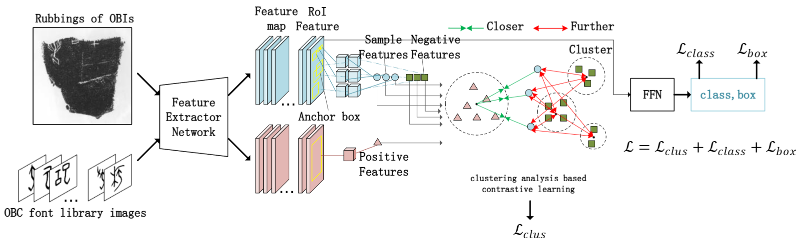

# Clustering-based-Feature-Representation-Learning-for-Oracle-Bone-Inscriptions-Detection

Oracle Bone Inscriptions (OBIs), play a crucial role in understanding ancient Chinese civilization. The automated detection of OBIs from rubbing images represents a fundamental yet challenging task in digital archaeology, primarily due to various degradation factors including noise and cracks that limit the effectiveness of conventional detection networks.
To address these challenges, we propose a novel clustering-based feature space representation learning method. Our approach uniquely leverages the Oracle Bones Character (OBC) font library dataset as prior knowledge to enhance feature extraction in the detection network through clustering-based representation learning. The method incorporates a specialized loss function derived from clustering results to optimize feature representation, which is then integrated into the total network loss.
We validate the effectiveness of our method by conducting experiments on two OBIs detection dataset using three mainstream detection frameworks: Faster R-CNN, DETR, and Sparse R-CNN. Through extensive experimentation, all frameworks demonstrate significant performance improvements.




# Usage - OBIs detection
There are no extra compiled components in DETR and package dependencies are minimal,
so the code is very simple to use. We provide instructions how to install dependencies via conda.
First, clone the repository locally:
```
git clone https://github.com/facebookresearch/detr.git
```
Then, install PyTorch 1.7+ and torchvision 0.8+:
```
conda install -c pytorch pytorch torchvision
```
Install pycocotools (for evaluation on COCO) and scipy (for training):
```
conda install cython scipy
pip install info-nce-pytorch
## Data preparation
coco and voc format will be need
```

## How to use
To train Faster R-CNN-R50 on a gpu run:
```
python train_res50_fpn.py 
```
To train DETR/DENO on a gpu run:
```
python main.py
```
To train Sparse R-CNN on two nodes with 2 gpus run:
```
NCCL_P2P_DISABLE=1 python -m torch.distributed.launch --nproc_per_node=2 --master_port xxxx main.py
```
For specific parameter Settings, you can refer to our paper.
